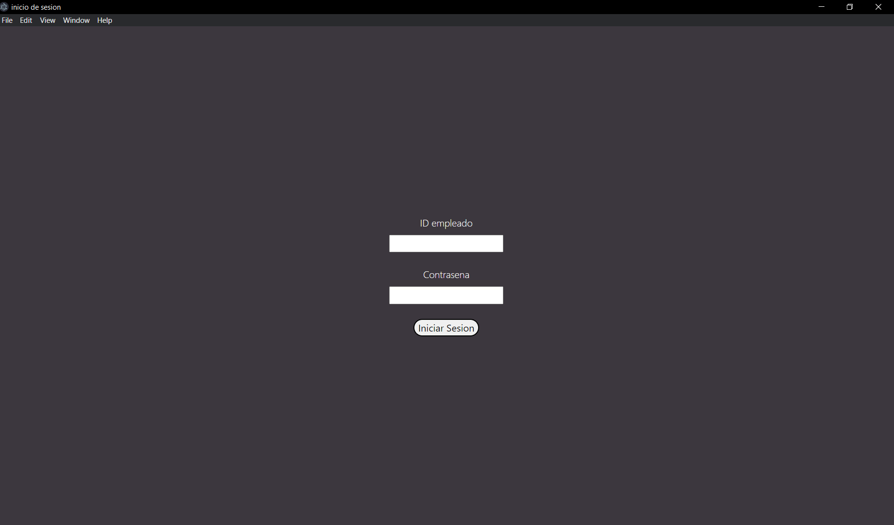

# Inventario Electron App
Un sistema de manejo de inventario de un supermercado.

## Login


## Lista productos


## Editar producto


## Pedido


## Usuarios y Constraseñas de prueba
| id usuario | nombre usuario | numero usuario | password  | hash                                                         |
|------------|----------------|----------------|-----------|--------------------------------------------------------------|
| 1          | user1          | 123456789      | password1 | `$2b$10$.gV3hKJcURC2mz00Anm1ie9kPKcpCLCfhNMRsRIAqOI8C1.yuTk6y` |
| 2          | user2          | 987654321      | password2 | `$2b$10$YEvUaUNRyNhV7afz39QTBupJm2maVtWFFUIpKRu0eLyTLdjAXOUO2` |
| 3          | user3          | 555555555      | password3 | `$2b$10$SKYT3uoDCqkl3k1V0RpdiO6Ry8bNhm7rQ7xEMb8sC4f2yLfN33GdS` |

## Crear Base de datos "supermercado_electron"
Ejecutar el script [`supermercado-electron.sql`](./supermercado-electron.sql) en MySQL.

### Conexion
Crear un usuario para la base de datos y colocar las respectivas credenciales en el objecto conexion en [`main.js`](./main.js).
```js
// -----------------------------------------------------------------------------
// 
// Crear conexion
// 

const conexion = mysql.createConnection({
    host: 'localhost', 
    user: 'USUARIO', 
    password: 'PASSWORD',
    database: 'supermercado_electron'
});

// -----------------------------------------------------------------------------
```